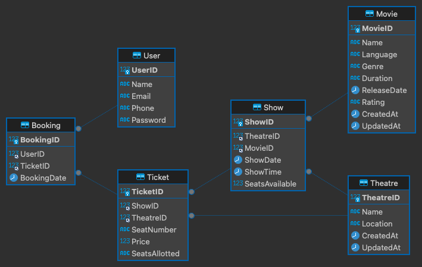

# Bookmyshow Database Structure Documentation

## Introduction

This document outlines the database structure for a ticketing platform similar to Bookmyshow. It includes entities, attributes, table structures, sample entries, and SQL query solutions.

## Entities and Attributes

### Theatre
  - TheatreID (Primary Key)
  - Name
  - Location

### Movie
  - MovieID (Primary Key)
  - Name
  - Language
  - Genre
  - Rating
  - Duration
  - ReleaseDate

### Show
  - ShowID (Primary Key)
  - TheatreID (Foreign Key)
  - MovieID (Foreign Key)
  - ShowDate
  - ShowTime

### Ticket
  - TicketID (Primary Key)
  - ShowID (Foreign Key)
  - TheatreID (Foreign Key)
  - SeatNumber
  - Price

### User
  - UserID (Primary Key)
  - Name
  - Email
  - Phone
  - Password

### Booking
  - BookingID (Primary Key)
  - UserID (Foreign Key)
  - TicketID (Foreign Key)
  - BookingDate

## Table Structures
To follow the normalization rules up to BCNF, the following tables are created:
 - 1NF: Primary Key and no repeating groups
 - 2NF: Must be in 1NF and no partial dependencies
 - 3NF: Must be in 2NF and no transitive dependencies
 - BCNF: Must be in 3NF and no overlapping candidate keys

### Theatre
| TheatreID | Name | Location |
| --- | --- | --- |
| 1 | PVR | Mumbai |
| 2 | INOX | Delhi |
| 3 | Carnival | Bangalore |


### Movie
| MovieID | Name | Language | Genre | Rating | Duration | ReleaseDate |
| --- | --- | --- | --- | --- | --- | --- |
| 1 | Avengers: Endgame | English | Action | PG-13 |  3h 2m | 26 April 2019 |
| 2 | Cast Away | English | Drama | A | 2h 55m | 21 June 2019 |
| 3 | Gone Girl | English | Crime | A | 2h 10m | 28 June 2019 |


### Show
| ShowID | TheatreID | MovieID | ShowDate | ShowTime |
| --- | --- | --- | --- | --- |
| 1 | 1 | 1 | 2019-07-01 | 09:00:00 |
| 2 | 1 | 1 | 2019-07-01 | 12:00:00 |
| 3 | 1 | 1 | 2019-07-01 | 15:00:00 |
| 4 | 1 | 1 | 2019-07-01 | 18:00:00 |
| 5 | 1 | 1 | 2019-07-01 | 21:00:00 |
| 6 | 1 | 2 | 2019-07-01 | 09:00:00 |

### Ticket
| TicketID | ShowID | TheatreID | SeatNumber | Price |
| --- | --- | --- | --- | --- |
| 1 | 1 | 1 | A1 | 300 |
| 2 | 1 | 1 | A2 | 300 |
| 3 | 1 | 1 | A3 | 300 |
| 4 | 1 | 1 | A4 | 300 |
| 5 | 1 | 1 | A5 | 300 |

### User
| UserID | Name | Email | Phone | Password |
| --- | --- | --- | --- | --- |
| 1 | John Doe | johndoe@example.com | 9876543210 | #<123456> |
| 2 | Jane Doe | janedoe@example.com | 9876543211 | #<123456> |

### Booking
| BookingID | UserID | TicketID | BookingDate |
| --- | --- | --- | --- |
| 1 | 1 | 1 | 2019-07-01 08:00:00 |
| 2 | 1 | 2 | 2019-07-01 08:00:00 |
| 3 | 1 | 3 | 2019-07-01 08:00:00 |

## SQL Queries

### 1 . SQL queries to create the tables

#### Theatre

```sql
--- SQL query to create the table Theatre with TheatreID as the primary key
CREATE TABLE Theatre (
  TheatreID INT NOT NULL AUTO_INCREMENT,
  Name VARCHAR(255) NOT NULL,
  Location VARCHAR(255) NOT NULL,
  PRIMARY KEY (TheatreID)
);
```

#### Movie

```sql
--- SQL query to create the table Movie with MovieID as the primary key
CREATE TABLE Movie (
  MovieID INT NOT NULL AUTO_INCREMENT,
  Name VARCHAR(255) NOT NULL,
  Language VARCHAR(255) NOT NULL,
  Genre VARCHAR(255) NOT NULL,
  Duration VARCHAR(255) NOT NULL,
  ReleaseDate DATE NOT NULL,
  PRIMARY KEY (MovieID)
);
```

```sql
--- Forgot to add the column Rating to the table Movie
--- SQL query to add the column Rating to the table Movie
ALTER TABLE Movie
ADD COLUMN Rating VARCHAR(255);
```

#### Show

```sql
--- SQL query to create the table Show with ShowID as the primary key
--- "SHOW" is a reserved keyword in MySQL
CREATE TABLE `Show` (
  ShowID INT NOT NULL AUTO_INCREMENT,
  TheatreID INT NOT NULL,
  MovieID INT NOT NULL,
  ShowDate DATE NOT NULL,
  ShowTime TIME NOT NULL,
  PRIMARY KEY (ShowID),
  FOREIGN KEY (TheatreID) REFERENCES Theatre(TheatreID),
  FOREIGN KEY (MovieID) REFERENCES Movie(MovieID)
);
```

#### Ticket

```sql
--- SQL query to create the table Ticket with TicketID as the primary key
CREATE TABLE Ticket (
  TicketID INT NOT NULL AUTO_INCREMENT,
  ShowID INT NOT NULL,
  TheatreID INT NOT NULL,
  SeatNumber VARCHAR(255) NOT NULL,
  Price INT NOT NULL,
  PRIMARY KEY (TicketID),
  FOREIGN KEY (ShowID) REFERENCES `Show`(ShowID),
  FOREIGN KEY (TheatreID) REFERENCES Theatre(TheatreID)
);
```

#### User

```sql
--- SQL query to create the table User with UserID as the primary key
CREATE TABLE User (
  UserID INT NOT NULL AUTO_INCREMENT,
  Name VARCHAR(255) NOT NULL,
  Email VARCHAR(255) NOT NULL,
  Phone VARCHAR(255) NOT NULL,
  Password VARCHAR(255) NOT NULL,
  PRIMARY KEY (UserID)
);
```

#### Booking

```sql
--- SQL query to create the table Booking with BookingID as the primary key
CREATE TABLE Booking (
  BookingID INT NOT NULL AUTO_INCREMENT,
  UserID INT NOT NULL,
  TicketID INT NOT NULL,
  BookingDate DATETIME NOT NULL,
  PRIMARY KEY (BookingID),
  FOREIGN KEY (UserID) REFERENCES User(UserID),
  FOREIGN KEY (TicketID) REFERENCES Ticket(TicketID)
);
```

### 2 . SQL queries to insert data into the tables [Sample Data]

#### Theatre

```sql
--- SQL query to insert data into the table Theatre
INSERT INTO Theatre (Name, Location) VALUES
  ('PVR', 'Mumbai'),
  ('INOX', 'Delhi'),
  ('Carnival', 'Bangalore');
```

#### Movie

```sql
--- SQL query to insert data into the table Movie
INSERT INTO Movie (Name, Language, Genre, Rating Duration, ReleaseDate) VALUES
  ('Avengers: Endgame', 'English', 'Action', 'PG-13',  '3h 2m', '2019-04-26'),
  ('Cast Away', 'English', 'Drama', 'A', '2h 55m', '2019-06-21'),
  ('Gone Girl', 'English', 'Crime', 'A', '2h 10m', '2019-06-28');
```

#### Show

```sql
--- SQL query to insert data into the table Show
INSERT INTO `Show` (TheatreID, MovieID, ShowDate, ShowTime) VALUES
  (1, 1, '2019-07-01', '09:00:00'),
  (1, 1, '2019-07-01', '12:00:00'),
  (1, 1, '2019-07-01', '15:00:00'),
  (1, 1, '2019-07-01', '18:00:00'),
  (1, 1, '2019-07-01', '21:00:00'),
  (1, 2, '2019-07-01', '09:00:00');
```

#### Ticket

```sql
--- SQL query to insert data into the table Ticket
INSERT INTO Ticket (ShowID, TheatreID, SeatNumber, Price) VALUES
  (1, 1, 'A1', 300),
  (1, 1, 'A2', 300),
  (1, 1, 'A3', 300),
  (1, 1, 'A4', 300),
  (1, 1, 'A5', 300);
```

#### User

```sql
--- SQL query to insert data into the table User
INSERT INTO User (Name, Email, Phone, Password) VALUES
  ('John Doe', 'johndoe@example.com', 9876543210, '#<123456>'),
  ('Jane Doe', 'janedoe@example.com', 9876543211, '#<123456>');
```

#### Booking

```sql
--- SQL query to insert data into the table Booking
INSERT INTO Booking (UserID, TicketID, BookingDate) VALUES
  (1, 1, '2019-07-01 08:00:00'),
  (1, 2, '2019-07-01 08:00:00'),
  (1, 3, '2019-07-01 08:00:00');
```

### 3 . SQL queries to retrieve data from the tables

#### Theatre

```sql
--- SQL query to retrieve data from the table Theatre
SELECT * FROM Theatre;
```

#### Movie

```sql
--- SQL query to retrieve data from the table Movie
SELECT * FROM Movie;
```

#### Show

```sql
--- SQL query to retrieve data from the table Show
SELECT * FROM Show;
```

#### Ticket

```sql
--- SQL query to retrieve data from the table Ticket
SELECT * FROM Ticket;
```

#### User

```sql
--- SQL query to retrieve data from the table User
SELECT * FROM User;
```

#### Booking

```sql
--- SQL query to retrieve data from the table Booking
SELECT * FROM Booking;
```

### 4 . SQL queries to update data in the tables

#### Theatre

```sql
--- SQL query to update data in the table Theatre
UPDATE Theatre SET Name = 'PVR Cinemas' WHERE TheatreID = 1;
```

#### Movie

```sql
--- SQL query to update data in the table Movie
UPDATE Movie SET Name = 'Avengers: Endgame - 3D' WHERE MovieID = 1;
```

#### Show

```sql
--- SQL query to update data in the table Show
UPDATE Show SET ShowTime = '10:00:00' WHERE ShowID = 1;
```

#### Ticket

```sql
--- SQL query to update data in the table Ticket
UPDATE Ticket SET Price = 350 WHERE TicketID = 1;
```

#### User

```sql
--- SQL query to update data in the table User
UPDATE User SET Phone = 9876543212 WHERE UserID = 1;
```

#### Booking

```sql
--- SQL query to update data in the table Booking
UPDATE Booking SET BookingDate = '2019-07-01 09:00:00' WHERE BookingID = 1;
```

### 5 . SQL queries to delete data from the tables

#### Theatre

```sql
--- SQL query to delete data from the table Theatre
DELETE FROM Theatre WHERE TheatreID = 1;
```

#### Movie

```sql
--- SQL query to delete data from the table Movie
DELETE FROM Movie WHERE MovieID = 1;
```

#### Show

```sql
--- SQL query to delete data from the table Show
DELETE FROM Show WHERE ShowID = 1;
```

#### Ticket

```sql
--- SQL query to delete data from the table Ticket
DELETE FROM Ticket WHERE TicketID = 1;
```

#### User

```sql
--- SQL query to delete data from the table User
DELETE FROM User WHERE UserID = 1;
```

#### Booking

```sql
--- SQL query to delete data from the table Booking
DELETE FROM Booking WHERE BookingID = 1;
```

### 6 . SQL Query to List Shows on a Given Date at a Given Theatre along with their show times

```sql
--- SQL query to list shows on a given date at a given theatre
SELECT * FROM Show WHERE TheatreID = 1 AND ShowDate = '2019-07-01';
```

```sql
--- SQL query to list shows on a given date at a given theatre along with their show times
SELECT s.ShowID, m.Name, AS MovieName, s.ShowTime
FROM Show s
JOIN Movie m ON s.MovieID = m.MovieID
WHERE s.TheatreID = 1 AND s.ShowDate = '2019-07-01';
```

## ER Diagram

