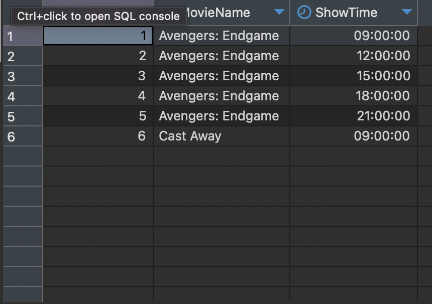

# Bookmyshow Database Structure Documentation

## Table of Contents
- [Introduction](#introduction)
- [Pre-requisites](#pre-requisites)
- [Entities and Attributes](#entities-and-attributes)
- [Theatre](#theatre)
- [Movie](#movie)
- [Show](#show)
- [Ticket](#ticket)
- [User](#user)
- [Booking](#booking)


## Introduction

This document outlines the database structure for a ticketing platform similar to Bookmyshow. It includes entities, attributes, table structures, sample entries, and SQL query solutions.

## Pre-requisites
- MySQL
- Dbeaver (or any other MySQL client) [Download DBeaver Client](https://dbeaver.io/download/)

## Entities and Attributes

### Theatre
  - TheatreID (Primary Key)
  - Name
  - Location

### Movie
  - MovieID (Primary Key)
  - Name
  - Language
  - Genre
  - Rating
  - Duration
  - ReleaseDate

### Show
  - ShowID (Primary Key)
  - TheatreID (Foreign Key)
  - MovieID (Foreign Key)
  - ShowDate
  - ShowTime

### Ticket
  - TicketID (Primary Key)
  - ShowID (Foreign Key)
  - TheatreID (Foreign Key)
  - SeatNumber
  - Price

### User
  - UserID (Primary Key)
  - Name
  - Email
  - Phone
  - Password

### Booking
  - BookingID (Primary Key)
  - UserID (Foreign Key)
  - TicketID (Foreign Key)
  - BookingDate

## Table Structures
To follow the normalization rules up to BCNF, the following tables are created:
 - 1NF: Primary Key and no repeating groups
 - 2NF: Must be in 1NF and no partial dependencies
 - 3NF: Must be in 2NF and no transitive dependencies
 - BCNF: Must be in 3NF and no overlapping candidate keys

### Theatre
| TheatreID | Name | Location |
| --- | --- | --- |
| 1 | PVR | Mumbai |
| 2 | INOX | Delhi |
| 3 | Carnival | Bangalore |


### Movie
| MovieID | Name | Language | Genre | Rating | Duration | ReleaseDate |
| --- | --- | --- | --- | --- | --- | --- |
| 1 | Avengers: Endgame | English | Action | PG-13 |  3h 2m | 26 April 2019 |
| 2 | Cast Away | English | Drama | A | 2h 55m | 21 June 2019 |
| 3 | Gone Girl | English | Crime | A | 2h 10m | 28 June 2019 |


### Show
| ShowID | TheatreID | MovieID | ShowDate | ShowTime |
| --- | --- | --- | --- | --- |
| 1 | 1 | 1 | 2019-07-01 | 09:00:00 |
| 2 | 1 | 1 | 2019-07-01 | 12:00:00 |
| 3 | 1 | 1 | 2019-07-01 | 15:00:00 |
| 4 | 1 | 1 | 2019-07-01 | 18:00:00 |
| 5 | 1 | 1 | 2019-07-01 | 21:00:00 |
| 6 | 1 | 2 | 2019-07-01 | 09:00:00 |

### Ticket
| TicketID | ShowID | TheatreID | SeatNumber | Price |
| --- | --- | --- | --- | --- |
| 1 | 1 | 1 | A1 | 300 |
| 2 | 1 | 1 | A2 | 300 |
| 3 | 1 | 1 | A3 | 300 |
| 4 | 1 | 1 | A4 | 300 |
| 5 | 1 | 1 | A5 | 300 |

### User
| UserID | Name | Email | Phone | Password |
| --- | --- | --- | --- | --- |
| 1 | John Doe | johndoe@example.com | 9876543210 | #<123456> |
| 2 | Jane Doe | janedoe@example.com | 9876543211 | #<123456> |

### Booking
| BookingID | UserID | TicketID | BookingDate |
| --- | --- | --- | --- |
| 1 | 1 | 1 | 2019-07-01 08:00:00 |
| 2 | 1 | 2 | 2019-07-01 08:00:00 |
| 3 | 1 | 3 | 2019-07-01 08:00:00 |

## API Documentation

### Theatre Endpoints

- `GET /theatres`: Get all theatres.
- `GET /theatres/:city`: Get theatres by city.
- `POST /theatres`: Create a theatre.
- `PUT /theatres/:theatreId`: Update a theatre.
- `DELETE /theatres/:theatreId`: Delete a theatre.

### Movie Endpoints

- `GET /movies`: Get all movies.
- `GET /movies/:movieId`: Get a movie by ID.
- `POST /movies`: Create a movie.
- `PUT /movies/:movieId`: Update a movie.
- `DELETE /movies/:movieId`: Delete a movie.

### Show Endpoints

- `GET /shows/:theatreId/:date`: Get shows by theatre and date.
- `POST /shows`: Create a show.
- `PUT /shows/:showId`: Update a show.
- `DELETE /shows/:showId`: Delete a show.

### Ticket Endpoints

- `GET /tickets/:showId`: Get tickets by show.
- `POST /tickets`: Create a ticket.
- `PUT /tickets/:ticketId`: Update a ticket.
- `DELETE /tickets/:ticketId`: Delete a ticket.

### User Endpoints

- `GET /users`: Get all users.
- `GET /users/:userId`: Get a user by ID.
- `POST /users`: Create a user.
- `PUT /users/:userId`: Update a user.
- `DELETE /users/:userId`: Delete a user.

### Booking Endpoints

- `GET /bookings/:userId`: Get bookings by user.
- `POST /bookings`: Create a booking.
- `PUT /bookings/:bookingId`: Update a booking.
- `DELETE /bookings/:bookingId`: Delete a booking.

## SQL Queries

### 1 . SQL queries to create the tables

#### Theatre

```sql
--- SQL query to create the table Theatre with TheatreID as the primary key
CREATE TABLE Theatre (
  TheatreID INT NOT NULL AUTO_INCREMENT,
  Name VARCHAR(255) NOT NULL,
  Location VARCHAR(255) NOT NULL,
  PRIMARY KEY (TheatreID)
);

ALTER TABLE Theatre
ADD COLUMN CreatedAt TIMESTAMP DEFAULT CURRENT_TIMESTAMP,
ADD COLUMN UpdatedAt TIMESTAMP DEFAULT CURRENT_TIMESTAMP ON UPDATE CURRENT_TIMESTAMP;
```

#### Movie

```sql
--- SQL query to create the table Movie with MovieID as the primary key
CREATE TABLE Movie (
  MovieID INT NOT NULL AUTO_INCREMENT,
  Name VARCHAR(255) NOT NULL,
  Language VARCHAR(255) NOT NULL,
  Genre VARCHAR(255) NOT NULL,
  Duration VARCHAR(255) NOT NULL,
  ReleaseDate DATE NOT NULL,
  PRIMARY KEY (MovieID)
);

ALTER TABLE Movie
ADD COLUMN CreatedAt TIMESTAMP DEFAULT CURRENT_TIMESTAMP,
ADD COLUMN UpdatedAt TIMESTAMP DEFAULT CURRENT_TIMESTAMP ON UPDATE CURRENT_TIMESTAMP;
```

```sql
--- Forgot to add the column Rating to the table Movie
--- SQL query to add the column Rating to the table Movie
ALTER TABLE Movie
ADD COLUMN Rating VARCHAR(255);
```

#### Show

```sql
--- SQL query to create the table Show with ShowID as the primary key
--- "SHOW" is a reserved keyword in MySQL
CREATE TABLE `Show` (
  ShowID INT NOT NULL AUTO_INCREMENT,
  TheatreID INT NOT NULL,
  MovieID INT NOT NULL,
  ShowDate DATE NOT NULL,
  ShowTime TIME NOT NULL,
  PRIMARY KEY (ShowID),
  FOREIGN KEY (TheatreID) REFERENCES Theatre(TheatreID),
  FOREIGN KEY (MovieID) REFERENCES Movie(MovieID)
);

ALTER TABLE `Show`
ADD COLUMN SeatsAvailable INT NOT NULL;
ADD COLUMN CreatedAt TIMESTAMP DEFAULT CURRENT_TIMESTAMP,
ADD COLUMN UpdatedAt TIMESTAMP DEFAULT CURRENT_TIMESTAMP ON UPDATE CURRENT_TIMESTAMP;
```

#### Ticket

```sql
--- SQL query to create the table Ticket with TicketID as the primary key
CREATE TABLE Ticket (
  TicketID INT NOT NULL AUTO_INCREMENT,
  ShowID INT NOT NULL,
  TheatreID INT NOT NULL,
  SeatNumber VARCHAR(255) NOT NULL,
  Price INT NOT NULL,
  PRIMARY KEY (TicketID),
  FOREIGN KEY (ShowID) REFERENCES `Show`(ShowID),
  FOREIGN KEY (TheatreID) REFERENCES Theatre(TheatreID)
);

ALTER TABLE Ticket
ADD COLUMN SeatsAllotted VARCHAR(255) NOT NULL;
ADD COLUMN CreatedAt TIMESTAMP DEFAULT CURRENT_TIMESTAMP,
ADD COLUMN UpdatedAt TIMESTAMP DEFAULT CURRENT_TIMESTAMP ON UPDATE CURRENT_TIMESTAMP;
```

#### User

```sql
--- SQL query to create the table User with UserID as the primary key
CREATE TABLE User (
  UserID INT NOT NULL AUTO_INCREMENT,
  Name VARCHAR(255) NOT NULL,
  Email VARCHAR(255) NOT NULL,
  Phone VARCHAR(255) NOT NULL,
  Password VARCHAR(255) NOT NULL,
  PRIMARY KEY (UserID)
);

ALTER TABLE User
ADD COLUMN CreatedAt TIMESTAMP DEFAULT CURRENT_TIMESTAMP,
ADD COLUMN UpdatedAt TIMESTAMP DEFAULT CURRENT_TIMESTAMP ON UPDATE CURRENT_TIMESTAMP;
```

#### Booking

```sql
--- SQL query to create the table Booking with BookingID as the primary key
CREATE TABLE Booking (
  BookingID INT NOT NULL AUTO_INCREMENT,
  UserID INT NOT NULL,
  TicketID INT NOT NULL,
  BookingDate DATETIME NOT NULL,
  PRIMARY KEY (BookingID),
  FOREIGN KEY (UserID) REFERENCES User(UserID),
  FOREIGN KEY (TicketID) REFERENCES Ticket(TicketID)
);

ALTER TABLE Booking
ADD COLUMN CreatedAt TIMESTAMP DEFAULT CURRENT_TIMESTAMP,
ADD COLUMN UpdatedAt TIMESTAMP DEFAULT CURRENT_TIMESTAMP ON UPDATE CURRENT_TIMESTAMP;
```

### 2 . SQL queries to insert data into the tables [Sample Data]

#### Theatre

```sql
--- SQL query to insert data into the table Theatre
INSERT INTO Theatre (Name, Location) VALUES
  ('PVR', 'Mumbai'),
  ('INOX', 'Delhi'),
  ('Carnival', 'Bangalore');
```

#### Movie

```sql
--- SQL query to insert data into the table Movie
INSERT INTO Movie (Name, Language, Genre, Rating Duration, ReleaseDate) VALUES
  ('Avengers: Endgame', 'English', 'Action', 'PG-13',  '3h 2m', '2019-04-26'),
  ('Cast Away', 'English', 'Drama', 'A', '2h 55m', '2019-06-21'),
  ('Gone Girl', 'English', 'Crime', 'A', '2h 10m', '2019-06-28');
```

#### Show

```sql
--- SQL query to insert data into the table Show
INSERT INTO `Show` (TheatreID, MovieID, ShowDate, ShowTime, SeatsAvailable) VALUES
  (1, 1, '2019-07-01', '09:00:00', 0),
  (1, 1, '2019-07-01', '12:00:00', 0),
  (1, 1, '2019-07-01', '15:00:00', 0),
  (1, 1, '2019-07-01', '18:00:00', 0),
  (1, 1, '2019-07-01', '21:00:00', 0),
  (1, 2, '2019-07-01', '09:00:00', 0);
```
```sql
--- SQL query to update SeatsAvailable in the table Show
UPDATE `Show` SET SeatsAvailable = 100 WHERE ShowID = 1;
```

#### Ticket

```sql
--- SQL query to insert data into the table Ticket
INSERT INTO Ticket (ShowID, TheatreID, SeatNumber, Price, SeatsAllotted) VALUES
  (1, 1, 'A1', 300, ''),
  (1, 1, 'A2', 300, ''),
  (1, 1, 'A3', 300, ''),
  (1, 1, 'A4', 300, ''),
  (1, 1, 'A5', 300, '');
```

#### User

```sql
--- SQL query to insert data into the table User
INSERT INTO User (Name, Email, Phone, Password) VALUES
  ('John Doe', 'johndoe@example.com', 9876543210, '#<123456>'),
  ('Jane Doe', 'janedoe@example.com', 9876543211, '#<123456>');
```

#### Booking

```sql
--- SQL query to insert data into the table Booking
INSERT INTO Booking (UserID, TicketID, BookingDate) VALUES
  (1, 1, '2019-07-01 08:00:00'),
  (1, 2, '2019-07-01 08:00:00'),
  (1, 3, '2019-07-01 08:00:00');
```

### 3 . SQL queries to retrieve data from the tables

#### Theatre

```sql
--- SQL query to retrieve data from the table Theatre
SELECT * FROM Theatre;
```

#### Movie

```sql
--- SQL query to retrieve data from the table Movie
SELECT * FROM Movie;
```

#### Show

```sql
--- SQL query to retrieve data from the table Show
SELECT * FROM `Show`;
```

#### Ticket

```sql
--- SQL query to retrieve data from the table Ticket
SELECT * FROM Ticket;
```

#### User

```sql
--- SQL query to retrieve data from the table User
SELECT * FROM User;
```

#### Booking

```sql
--- SQL query to retrieve data from the table Booking
SELECT * FROM Booking;
```

### 4 . SQL queries to update data in the tables

#### Theatre

```sql
--- SQL query to update data in the table Theatre
UPDATE Theatre SET Name = 'PVR Cinemas' WHERE TheatreID = 1;
```

#### Movie

```sql
--- SQL query to update data in the table Movie
UPDATE Movie SET Name = 'Avengers: Endgame - 3D' WHERE MovieID = 1;
```

#### Show

```sql
--- SQL query to update data in the table Show
UPDATE `Show` SET ShowTime = '10:00:00' WHERE ShowID = 1;
```

#### Ticket

```sql
--- SQL query to update data in the table Ticket
UPDATE Ticket SET Price = 350 WHERE TicketID = 1;
```

#### User

```sql
--- SQL query to update data in the table User
UPDATE User SET Phone = 9876543212 WHERE UserID = 1;
```

#### Booking

```sql
--- SQL query to update data in the table Booking
UPDATE Booking SET BookingDate = '2019-07-01 09:00:00' WHERE BookingID = 1;
```

### 5 . SQL queries to delete data from the tables

#### Theatre

```sql
--- SQL query to delete data from the table Theatre
DELETE FROM Theatre WHERE TheatreID = 1;
```

#### Movie

```sql
--- SQL query to delete data from the table Movie
DELETE FROM Movie WHERE MovieID = 1;
```

#### Show

```sql
--- SQL query to delete data from the table Show
DELETE FROM `Show` WHERE ShowID = 1;
```

#### Ticket

```sql
--- SQL query to delete data from the table Ticket
DELETE FROM Ticket WHERE TicketID = 1;
```

#### User

```sql
--- SQL query to delete data from the table User
DELETE FROM User WHERE UserID = 1;
```

#### Booking

```sql
--- SQL query to delete data from the table Booking
DELETE FROM Booking WHERE BookingID = 1;
```

### 6. Stored Procedure to Book a Ticket

```sql
DELIMITER $$

CREATE FUNCTION SPLIT_STR(
  x VARCHAR(255),
  delim VARCHAR(12),
  pos INT
) RETURNS VARCHAR(255)
DETERMINISTIC
BEGIN
    RETURN REPLACE(SUBSTRING(SUBSTRING_INDEX(x, delim, pos),
               LENGTH(SUBSTRING_INDEX(x, delim, pos -1)) + 1),
               delim, '');
END$$

DELIMITER ;


```
#### Testing the function

```sql
SELECT SPLIT_STR('1,2,3', ',', 1);
```

```sql
DELIMITER $$

CREATE PROCEDURE BookMultipleTickets(
    IN p_UserID INT,
    IN p_TicketIDs VARCHAR(255),
    IN p_SeatNumbers VARCHAR(255),
    IN p_BookingDate DATETIME
)
BEGIN
    DECLARE v_TicketID INT;
    DECLARE v_SeatNumber VARCHAR(255);
    DECLARE v_ShowID INT;
    -- DECLARE v_SeatsAvailable INT;
    DECLARE v_Index INT DEFAULT 1;
    DECLARE v_TicketIDsArrayLength INT;

    -- Temporary tables or string variables to accumulate data
    DECLARE bookingEntries TEXT DEFAULT '';
    DECLARE ticketUpdates TEXT DEFAULT '';

    DECLARE EXIT HANDLER FOR SQLEXCEPTION
    BEGIN
        -- Rollback if error occurs
        ROLLBACK;
    END;
    -- DECLARE showUpdates TEXT DEFAULT '';
    CREATE TEMPORARY TABLE IF NOT EXISTS TempShowUpdates (
      ShowID INT,
      TicketCount INT
    );

    -- Reset the temporary table
    TRUNCATE TABLE TempShowUpdates;
    
    -- Calculate the number of tickets
    SET v_TicketIDsArrayLength = (LENGTH(p_TicketIDs) - LENGTH(REPLACE(p_TicketIDs, ',', ''))) + 1;

    -- Start transaction
    START TRANSACTION;

    WHILE v_Index <= v_TicketIDsArrayLength DO
        -- Extract ticket ID and seat number
        SET v_TicketID = CAST(SPLIT_STR(p_TicketIDs, ',', v_Index) AS UNSIGNED);
        SET v_SeatNumber = SPLIT_STR(p_SeatNumbers, ',', v_Index);

        -- Accumulate booking entries
        SET bookingEntries = CONCAT(bookingEntries, '(', p_UserID, ',', v_TicketID, ',', QUOTE(p_BookingDate), '),');

        -- Accumulate ticket updates
        SET ticketUpdates = CONCAT(ticketUpdates, 'WHEN ', v_TicketID, ' THEN CONCAT(SeatsAllotted, \',\', ', QUOTE(v_SeatNumber), ') ');

        -- Accumulate show updates (count tickets per show)
        -- SET showUpdates = CONCAT(showUpdates, 'WHEN ', v_ShowID, ' THEN SeatsAvailable - 1 ');

        -- -- Insert into Booking table
        -- INSERT INTO Booking (UserID, TicketID, BookingDate) 
        -- VALUES (p_UserID, v_TicketID, p_BookingDate);

        -- -- Update SeatsAllotted in Ticket table
        -- UPDATE Ticket 
        -- SET SeatsAllotted = CONCAT(IFNULL(SeatsAllotted, ''), ',', v_SeatNumber) 
        -- WHERE TicketID = v_TicketID;

        -- -- Get ShowID from Ticket
        -- SELECT ShowID INTO v_ShowID FROM Ticket WHERE TicketID = v_TicketID;

        -- -- Get current SeatsAvailable from Show
        -- SELECT SeatsAvailable INTO v_SeatsAvailable FROM `Show` WHERE ShowID = v_ShowID;

        -- -- Update SeatsAvailable in Show table
        -- Extract ShowID for each ticket and insert into temporary table
        SELECT ShowID INTO v_ShowID FROM Ticket WHERE TicketID = v_TicketID;
        INSERT INTO TempShowUpdates (ShowID, TicketCount)
        VALUES (v_ShowID, 1)
        ON DUPLICATE KEY UPDATE TicketCount = TicketCount + 1;
        -- UPDATE `Show` 
        -- SET SeatsAvailable = v_SeatsAvailable - 1 
        -- WHERE ShowID = v_ShowID;

        SET v_Index = v_Index + 1;
    END WHILE;

    -- Remove trailing comma
    SET bookingEntries = LEFT(bookingEntries, LENGTH(bookingEntries) - 1);

    -- Bulk insert into Booking
    SET @s = CONCAT('INSERT INTO Booking (UserID, TicketID, BookingDate) VALUES ', bookingEntries);
    PREPARE stmt FROM @s;
    EXECUTE stmt;
    DEALLOCATE PREPARE stmt;

    -- Bulk update Ticket
    SET @s = CONCAT('UPDATE Ticket SET SeatsAllotted = CASE TicketID ', ticketUpdates, ' END WHERE TicketID IN (', p_TicketIDs, ')');
    PREPARE stmt FROM @s;
    EXECUTE stmt;
    DEALLOCATE PREPARE stmt;

    -- Bulk update Shows
    -- SET @s = CONCAT('UPDATE `Show` SET SeatsAvailable = CASE ShowID ', showUpdates, ' END WHERE ShowID IN (SELECT DISTINCT ShowID FROM Ticket WHERE TicketID IN (', p_TicketIDs, '))');
    -- PREPARE stmt FROM @s;
    -- EXECUTE stmt;
    -- DEALLOCATE PREPARE stmt;
    UPDATE `Show` AS s
    JOIN (SELECT ShowID, SUM(TicketCount) AS TotalTickets FROM TempShowUpdates GROUP BY ShowID) AS t
    ON s.ShowID = t.ShowID
    SET s.SeatsAvailable = s.SeatsAvailable - t.TotalTickets;

    -- Commit transaction
    COMMIT;

    DROP TEMPORARY TABLE IF EXISTS TempShowUpdates;
END$$

DELIMITER ;


```

#### Sample Usage

```sql
CALL BookMultipleTickets(1, '3,4,5', 'A3,B4,B5', '2023-11-14 08:00:00');
```

### 7. SQL Query to List Shows on a Given Date at a Given Theatre along with their show times

```sql
--- SQL query to list shows on a given date at a given theatre
SELECT * FROM `Show` WHERE TheatreID = 1 AND ShowDate = '2019-07-01';
```

```sql
--- SQL query to list shows on a given date at a given theatre along with their show times
SELECT s.ShowID, m.Name, AS MovieName, s.ShowTime
FROM Show s
JOIN Movie m ON s.MovieID = m.MovieID
WHERE s.TheatreID = 1 AND s.ShowDate = '2019-07-01';
```

#### Sample Output



## ER Diagram


## Testing
The SQL statements provided have been tested on MySQL using Dbeaver.